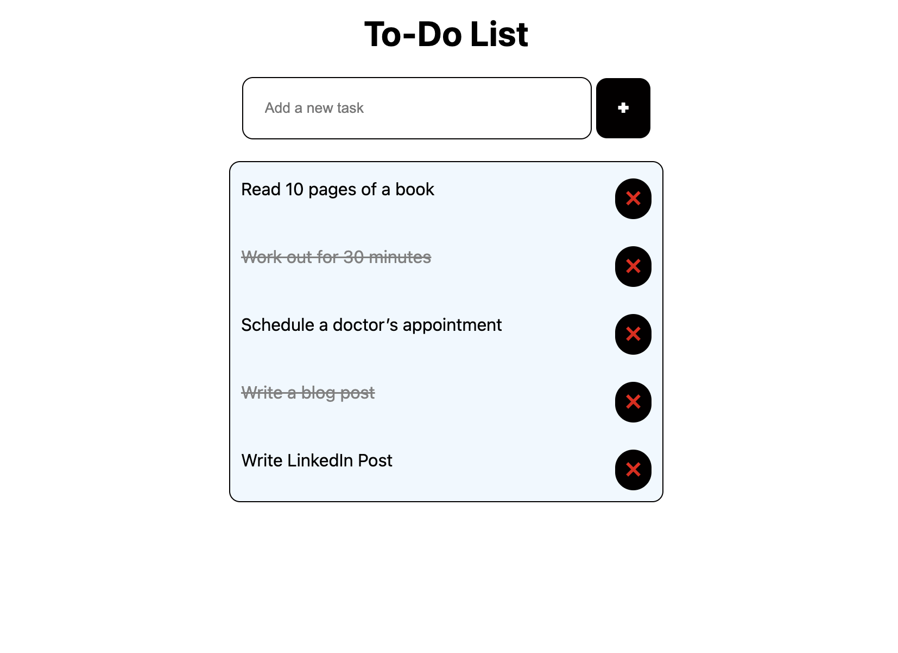

## Features
- **Add a new task**
- **Mark task as completed**
- **Delete a task**
- **Save tasks in `localStorage` (persistent after refresh)**

## Desktop Preview


### Adding a Task
Handles user input and updates the task list.
```js
function addTask() {
    let taskInput = document.getElementById("task-input");
    let taskText = taskInput.value.trim();
    if (taskText === "") return;

    let tasks = JSON.parse(localStorage.getItem("tasks")) || [];
    tasks.push({ text: taskText, completed: false });
    localStorage.setItem("tasks", JSON.stringify(tasks));

    renderTask(taskText, tasks.length - 1);
    taskInput.value = "";
}

### Dynamically creates a task element in the list.

function renderTask(task, index) {
    let taskList = document.getElementById("task-list");
    let li = document.createElement("li");
    li.innerHTML = `<span onclick="toggleTask(${index})">${task.text}</span> 
                    <button onclick="deleteTask(${index})">❌</button>`;
    taskList.appendChild(li);
}


### Marking a Task as Completed

function toggleTask(index) {
    let tasks = JSON.parse(localStorage.getItem("tasks")) || [];
    tasks[index].completed = !tasks[index].completed;
    localStorage.setItem("tasks", JSON.stringify(tasks));
    loadTasks();
}

### Deleting a Task

function deleteTask(index) {
    let tasks = JSON.parse(localStorage.getItem("tasks")) || [];
    tasks.splice(index, 1);
    localStorage.setItem("tasks", JSON.stringify(tasks));
    loadTasks();
}


### Loading Tasks on Page Refresh

function loadTasks() {
    let tasks = JSON.parse(localStorage.getItem("tasks")) || [];
    document.getElementById("task-list").innerHTML = "";
    tasks.forEach((task, index) => renderTask(task, index));
}
document.addEventListener("DOMContentLoaded", loadTasks);


