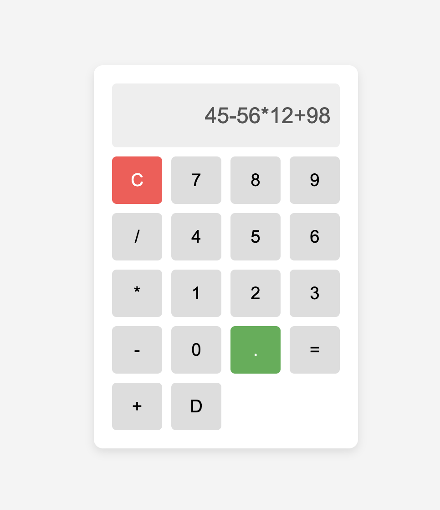
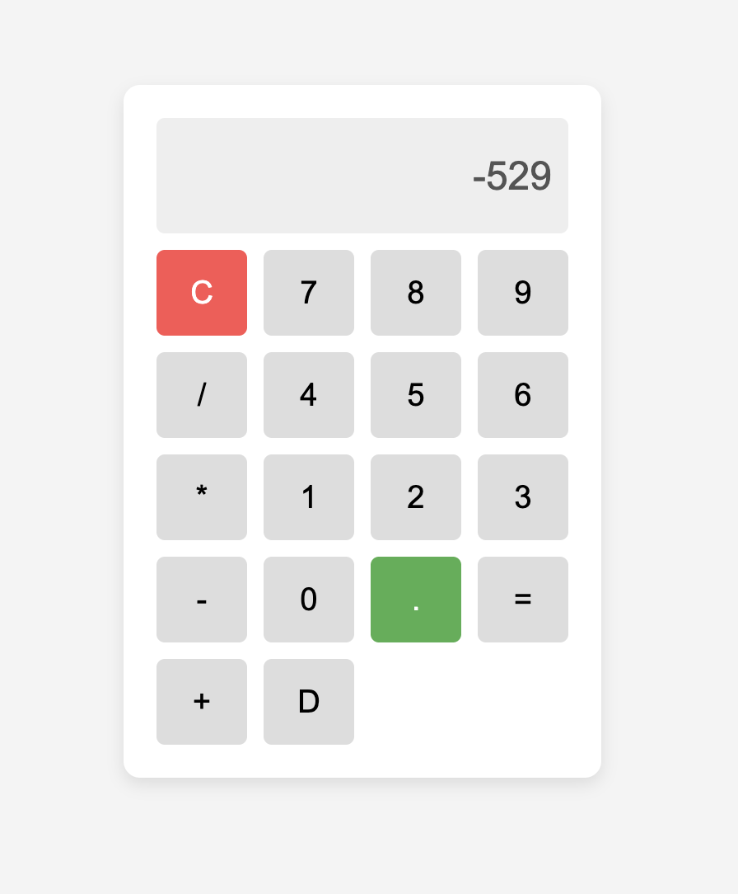

## Desktop Preview



### **Appending Numbers/Operators to the Display**  
This function adds the clicked number or operator to the display input.  
```js
function appendToDisplay(value) {
    document.getElementById("display").value += value;
}

Clears the calculator screen when C (Clear) is clicked.
function clearDisplay() {
    document.getElementById("display").value = "";
}


Computes the result when = is clicked using eval().
Catches invalid expressions and shows "Error".
function calculateResult() {
    try {
        let result = eval(document.getElementById("display").value);
        document.getElementById("display").value = result;
    } catch (error) {
        document.getElementById("display").value = "Error";
    }
}

To delete the single value 
function deleteElement()
{
document.getElementById("display").value = document.getElementById("display").value.slice(0, -1);
}
