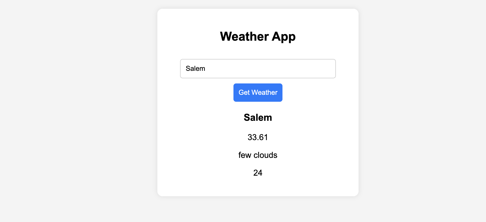

# Weather App Guide

This guide explains how to build a simple weather app using the OpenWeatherMap API.

## Step 1: Configure API Key and URL

1. Obtain an API key from [OpenWeatherMap](https://openweathermap.org/).
2. Define the API key and base URL in a separate `config.js` file to ensure it is ignored in `.gitignore`.

```javascript

const apiKey = 'your_api_key_here';
const apiUrl = 'https://api.openweathermap.org/data/2.5/weather?q=';
```

## Step 2: Fetch Weather Data

Define a function to fetch weather data from the API by providing the city as input.

```javascript
function fetchWeather(city) {
    fetch(`${apiUrl}${city}&appid=${apiKey}&units=metric`)
        .then(response => {
            if (response.ok) {
                return response.json();
            }
            throw new Error('Request failed!');
        })
        .then(data => updateWeather(data))
        .catch(error => showError(error));
}
```

## Step 3: Update Weather Data

Create a function to update the fetched data into the `textContent` of the required HTML elements.

```javascript
function updateWeather(data) {
    document.getElementById("weather-city").textContent = data.name;
    document.getElementById("weather-temp").textContent = data.main.temp;
    document.getElementById("weather-desc").textContent = data.weather[0].description;
    document.getElementById("weather-humidity").textContent = data.main.humidity;
}
```

## Step 4: Handle Errors

Define a function to handle errors and update the UI accordingly.

```javascript
function showError(error) {
    document.getElementById("weather-city").textContent = "Error";
    document.getElementById("weather-temp").textContent = "";
    document.getElementById("weather-desc").textContent = "";
    document.getElementById("weather-humidity").textContent = "";
}
```

## Step 5: Add Event Listener

Add an event listener to the button to fetch the weather data based on the user's input.

```javascript
document.getElementById("search-btn").addEventListener("click", function () {
    let city = document.getElementById("city-input").value.trim();
    if (city) fetchWeather(city);
    console.log(city);
});
```

## Notes

- Ensure `config.js` is listed in your `.gitignore` file to avoid exposing your API key.
- Use proper error handling to improve user experience.


## Output

