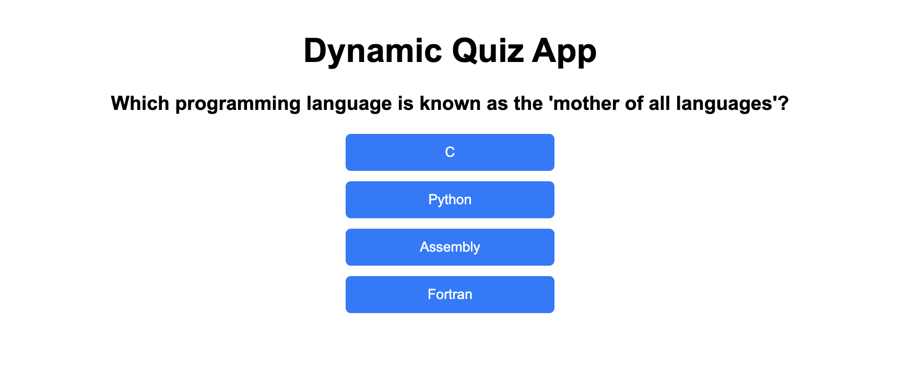

## Explanation of the JavaScript Code

The JavaScript code implements the core functionality of the quiz application. Here's a breakdown of how it works:

### 1. **Selecting HTML Elements**
```javascript
const quizContainer = document.getElementById("quiz");
const resultContainer = document.getElementById("result");
```
- These lines select the HTML elements where the quiz questions (`quizContainer`) and the results (`resultContainer`) will be displayed.

---

### 2. **Initializing Variables**
```javascript
let currentQuestionIndex = 0;
let score = 0;
let questions = [];
```
- `currentQuestionIndex`: Tracks the current question being displayed.
- `score`: Keeps track of the user's correct answers.
- `questions`: Stores the quiz questions fetched from the `questions.json` file.

---

### 3. **Fetching Questions**
```javascript
fetch("questions.json")
    .then(response => response.json())
    .then(data => {
         questions = data;
         loadQuestion();
    })
    .catch(error => console.error("Error loading questions:", error));
```
- The `fetch` function retrieves the quiz questions from the `questions.json` file.
- The response is converted to JSON format and stored in the `questions` array.
- Once the questions are loaded, the `loadQuestion` function is called to display the first question.
- If there's an error during fetching, it is logged to the console.

---

### 4. **Loading a Question**
```javascript
function loadQuestion() {
    if (currentQuestionIndex >= questions.length) {
         showResults();
         return;
    }

    const questionData = questions[currentQuestionIndex];
    quizContainer.innerHTML = `<h3>${questionData.question}</h3>`;

    questionData.options.forEach((option, index) => {
         const button = document.createElement("button");
         button.innerText = option;
         button.classList.add("option");
         button.addEventListener("click", () => checkAnswer(index));
         quizContainer.appendChild(button);
    });
}
```
- This function displays the current question and its options:
  - If all questions have been answered, it calls `showResults` to display the score.
  - Otherwise, it retrieves the current question and its options from the `questions` array.
  - Each option is displayed as a button, and a click event listener is added to handle the user's answer.

---

### 5. **Checking the Answer**
```javascript
function checkAnswer(selectedIndex) {
    if (questions[currentQuestionIndex].correct === selectedIndex) {
         score++;
    }
    currentQuestionIndex++;
    loadQuestion();
}
```
- This function checks if the selected option is correct:
  - If the selected index matches the correct answer index, the score is incremented.
  - The `currentQuestionIndex` is updated to move to the next question.
  - The `loadQuestion` function is called again to display the next question.

---

### 6. **Displaying Results**
```javascript
function showResults() {
    quizContainer.innerHTML = "";
    resultContainer.innerHTML = `<h2>Your Score: ${score} / ${questions.length}</h2>`;
}
```
- This function clears the quiz container and displays the user's score in the result container.

---

## Output
