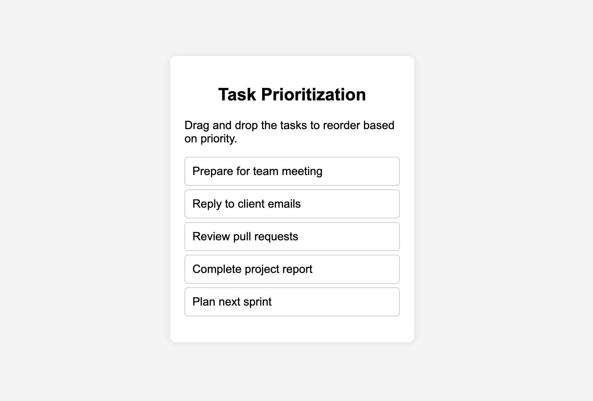

### 1. Create the List of Tasks

First, create a list of tasks that you want to drag and reorder.

```javascript
const list = document.getElementById("sortable-list");
let draggedItem = null;
```

The `list` will store all the `<li>` items that need to be rearranged.

### 2. Add Event Listeners

#### a. `dragstart` Event

The `dragstart` event listens for changes in the list elements. When you start dragging an `<li>` element, it is triggered, and the dragged item is stored in `draggedItem`. Additionally, the `dragging` class is appended to the `<li>` so that the defined style is applied.

```javascript
list.addEventListener("dragstart", (event) => {
    draggedItem = event.target;
    event.target.classList.add("dragging");
});
```

#### b. `dragover` Event

By default, dropping is not allowed. The `event.preventDefault()` method enables dropping. The `afterElement` contains the element below the mouse pointer and is added accordingly to the condition.

```javascript
list.addEventListener("dragover", (event) => {
    event.preventDefault();
    const afterElement = getDragAfterElement(list, event.clientY);
    if (afterElement == null) {
        list.appendChild(draggedItem);
    } else {
        list.insertBefore(draggedItem, afterElement);
    }
});
```

#### c. `dragend` Event

Once the dragging is stopped, this function is called, and the `dragging` class is removed.

```javascript
list.addEventListener("dragend", (event) => {
    event.target.classList.remove("dragging");
    draggedItem = null;
});
```

### 3. Helper Function: `getDragAfterElement`

This function determines the element after which the dragged item should be placed.

```javascript
function getDragAfterElement(container, y) {
    const draggableElements = [...container.querySelectorAll("li:not(.dragging)")];

    return draggableElements.reduce((closest, child) => {
        const box = child.getBoundingClientRect();
        const offset = y - box.top - box.height / 2;

        if (offset < 0 && offset > closest.offset) {
            return { offset: offset, element: child };
        } else {
            return closest;
        }
    }, { offset: Number.NEGATIVE_INFINITY }).element;
}
```

#### Explanation:

1. **Get all draggable `<li>` elements except the one currently being dragged:**

    ```javascript
    const draggableElements = [...container.querySelectorAll("li:not(.dragging)")];
    ```

2. **Loop through each list item to determine where to drop:**

    - Get the bounding box:
        ```javascript
        const box = child.getBoundingClientRect();
        ```

    - Calculate the cursor’s position relative to the element:
        ```javascript
        const offset


## Output
