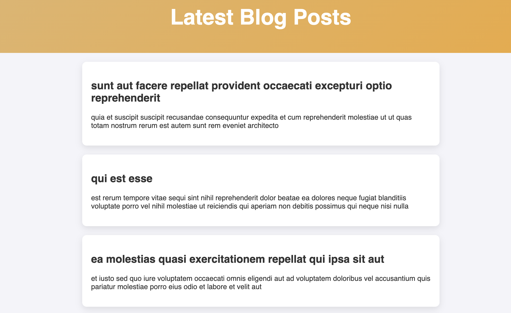

### **Fetching Data from API**
- Uses the **Fetch API** to request posts from `JSONPlaceholder`.
- Limits each request to **5 posts** using `_limit` and `_page` parameters.

#### **Example:**
```js
const apiURL = "https://jsonplaceholder.typicode.com/posts";
async function fetchPosts() {
    const response = await fetch(`${apiURL}?_limit=5&_page=${page}`);
    const data = await response.json();
    data.forEach(post => addPostToPage(post));
    page++;
}
```
- Calls `fetch()` to get **posts**.
- Parses response as **JSON**.
- Adds posts to the page with `addPostToPage(post)`.

---

### **Appending Posts Dynamically**
- New posts are added inside the `#content` container.

#### **Example:**
```js
function addPostToPage(post) {
    const postElement = document.createElement("div");
    postElement.classList.add("post");
    postElement.innerHTML = `<h2>${post.title}</h2><p>${post.body}</p>`;
    content.appendChild(postElement);
}
```
- Creates a `div` for each post.
- Adds **title & body** inside the post.
- Appends the post **inside the main content area**.

---

### **Detecting Scroll Position**
- Listens for the `scroll` event and checks when the user reaches the **bottom**.
- Calls `fetchPosts()` to load more content when needed.

#### **Example:**
```js
window.addEventListener("scroll", () => {
    if (window.innerHeight + window.scrollY >= document.body.offsetHeight - 100) {
        fetchPosts();
    }
});
```
- `window.innerHeight + window.scrollY` → **Current Scroll Position**
- `document.body.offsetHeight` → **Total Page Height**
- If the user is **100px near the bottom**, new posts load.

---

###  **Loading Animation**
- Shows a **spinner** while fetching new posts.

#### **Example:**
```js
loading.style.display = "block"; 
setTimeout(() => {
    loading.style.display = "none";
}, 800); 
```
- Appears before fetching starts.
- Disappears once content loads.

---

## Output



